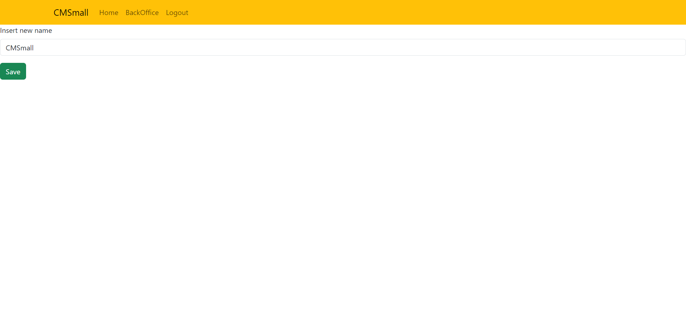

[](https://classroom.github.com/a/suhcjUE-)
# Exam #1: "CMSmall"
## Student: SCARSO GIUSEPPE 

## React Client Application Routes

- Route `/`: show the list of published pages, there is the possibility to visualize the content for each page, the title bar is always present
- Route `/login`: login page

- Route `/backoffice`: show the list of all the pages, the author(or admin) of each page can modify or delete it

- Route `/backoffice/create`: a simple form for the creation of a new page, after the creation the new page is dispayed and it can be modified

- Route `/backoffice/edit/:pageid`: here you can edit a selected page
  - pageid: the id of the selected page

- Route `/backoffice/editName`: a simple form accessible only to the admin, it allows the app name change

- Route `/backoffice/edit/:pageid/addBlockForm`: a form that allows the insertion of a new block on the page
  - pageid: the id of the page that contains the block

- Route `/backoffice/edit/:pageid/:blockid`: a form that allows the modification of a block on the page
  - pageid: the id of the page that contains the block
  - blockid: the id of selected block
  
- Route `/pages/:pageid`: shows the content of a page
  - pageid: the id of the selected page  

## API Server

Tutte le API server che necessitano di un controllo utente possono ritornare una risposta con codice 401(non autorizzato)

- POST `/api/login`
  - request body: credentials to log in
    ``` json
    {
      "username": "giuseppe@polito.it",
      "password": ""
    }
    ```
  - response body content
    - if success the authenticated user:
      ``` json
      {
        "id": 1,
        "username": "giuseppe@polito.it",
        "name": "Giuseppe", 
        "admin": false
      }
      ```
    - error response: 401

- GET `/api/sessions/current`
  - request parameters: None
  - response body content:
    ``` json
      {
        "id": 1,
        "username": "giuseppe@polito.it",
        "name": "Giuseppe", 
        "admin": false
      }
      ```
  - error response: 401
- DELETE `/api/sessions/current`
  - request parameters: None  
  - response body content: None

- GET `/name`
  - request parameters: None 
  - response body content:
    ``` json
      {
        "name": "CMSmall"
      }
    ```
  - error response: 500

- PUT `/page`
  - request parameters: None
  - request body content:
    ``` json
      {
        "name": "CMSmall"
      }
    ```
  - response body content: None(status 200 OK)
  - error response: 500

- GET `/pages/published`
  - request parameters: None
  - response body content: 
    ``` json
      [
        {
          "id": 2, 
          "title": "My blog", 
          "author": "Giuseppe", 
          "status": "pubblicata", 
          "date": "2023/06/21", 
          "dataCreazione": "2023/05/12"
        },
        {
          "id": 1, 
          "title": "My photos", 
          "author": "Giuseppe", 
          "status": "pubblicata", 
          "date": "2023/05/12", 
          "dataCreazione": "2023/05/12"
        },
        ...
      ]
    ```
  - error response: 500

- GET `/pages/all`
  - request parameters: None
  - response body content: 
    ``` json
      [
        {
          "id": 2, 
          "title": "My blog", 
          "author": "Giuseppe", 
          "status": "pubblicata", 
          "date": "2023/06/21", 
          "dataCreazione": "2023/05/12"
        },
        {
          "id": 1, 
          "title": "My photos", 
          "author": "Giuseppe", 
          "status": "pubblicata", 
          "date": "2023/05/12", 
          "dataCreazione": "2023/05/12"
        },
        ...
      ]
    ```
  - error response: 500

- GET `/pages/:id`
  - request parameters: id(the id of the desidered page)
  - response body content: 
    ``` json
      [
        {
          "block_id": 2, 
          "type": "header", 
          "content": "Perchè ho scritto questa pagina?", 
          "index": 0, 
          "page_id": 2
        },
        {
          "block_id": 8, 
          "type": "paragraph", 
          "content": "Ho scritto questa pagina perchè mi andava", 
          "index": 01, 
          "page_id": 2
        },
        ...
      ]
    ```
  - error response: 500

- GET `/pages/:id/title`
  - request parameters: id(the id of the desidered page)
  - response body content:
    ``` json
      {"title": "My blog"}
    ``` 
  - error response: 500

- GET `/images`
  - request parameters: None
  - response body content:
    ``` json
      [
        {"imageName": "image1.jpg"},
        {"imageName": "image2.jpg"},
        {"imageName": "image3.jpg"},
        {"imageName": "image4.jpg"},
        ...
      ]
    ``` 
  - error response: 500

- POST `/pages`
  - request parameters: None
  - request body content:
    ``` json
      {
        "title": "new Page",
        "draft": false,
        "date": "2023-06-06"
      }
    ```
  - response content: 
    ``` json
      {"id": 5}
    ```
  - error response: 400 or 422

- GET `/authors`
  - request parameters: None
  - response body content:
    ``` json
      {
        [
          {"name":"Giuseppe"},
          {"name":"Pippo"},
          ...
        ]
      }
      ```
  - error response: 400

- GET `/blocks/:blockid`
  - request parameter:
    - blockid: the id of the desidered block 
  - response body content:
    ``` json
      {"id": 79, 
      "type": "paragraph", 
      "content": "Guarda la seguente immagine:", 
      "indice": 1, 
      "page": 2}
    ``` 
  - error response: 400

- POST `/pages/:id`
  - request parameter:
    - id: the id of the page in which you want to add a block or edit a property, the type field may also be for example date or author, it depends on the edit option
  - request body:
     ``` json
        {
          "type":"header",
          "content": "nuovo header"
        }
     ```
  - response body:
    ``` json
      {
        "b_id": 27
      }
    ```
  - error response: 400

- PUT `/pages/:pageid/:blockid`
  - request parameters: 
    - pageid: the id of the page containing the block
    - blockid: the id of the block you want to edit
  - request body:
  ``` json
    {
      "id": 93,
      "type": "header",
      "content": "La migliore delle foto",
      "page": 1
    }
  ```
  - response body: none
  - error response: 400

- PUT `/backoffice/edit/:pageid`
  - request parameters: 
    - pageid: the id of the page in which the block order has changed
  - request body:
    ```json
      [
        {
          "block_id": 1,
          "type": "header",
          "content": "In questa pagina parleremo di cose belle",
          "index": 0,
          "page_id": 1
        },
        {
          "block_id": 93,
          "type": "header",
          "content": "La migliore delle foto",
          "index": 1,
          "page_id": 1
        },
        {
          "block_id": 80,
          "type": "image",
          "content": "image3.jpg",
          "index": 2,
          "page_id": 1
        }
      ]
    ```
  - response body: none
  - error response: 400


- DELETE `/pages/:id`
  - request parameters: 
    - id: the id of the page to delete
  - request body: none
  - response body:
    ``` json
      {
        "changes": 1
      }
    ```
   - error response: 400 or 404 

- DELETE `/pages/:pageid/:blockid`
  - request parameters:
    - pageid: the id of the page that contains the block to be deleted
    - blockid: the id of the block to be deleted
    - request body: none
    - response body:
      ``` json
        {
          "changes": 1
        }
      ```
    error response: 503


## Database Tables

- Table `users` - columns id name email hash salt, contains all the users
- Table `admins` - columns id, contains all the admin user (foreign key)
- Table `site` - columns name, contains the webapp name
- Table `pages` - columns id author title status data dataCreazione, contains the list of all the created pages
- Table `blocks` - columns id type content indice page, contains all the block associated to each page
- Table `images` - columns imageName, contains a list of available images

## Main React Components

- `TitleBar` (in `TitleBar.jsx`): contains the upper navbar with al the links to the sections(Home,BackOffice,Login)
- `PageList` (in `PageList.jsx`): component that shows all the published pages
- `LoginForm` (in `AuthComponents`): contains the login form
- `PageListBack` (in `BackOffice.jsx`): component that shows all the pages(backoffice)
- `PageCreation` (in `PageCreation.jsx`): contains the form to create a new page
- `PageShowEdit` (in `ShowEditPage.jsx`): show a page and all the edit options (adding/deleting block, changing block order, ...)  
- `Name` (in `SiteName.jsx`): contains the form in which the admin can modify the site name
- `CreationForm` (in `CreateForm.jsx`): contains the form to create a new block to set other options like the publication date or the author(only for admin)
- `BlockEditForm` (in `BlockEdit.jsx`): contains the form to edit a block
- `PageShow` (in `PageShow.jsx`): show a page without any edit option

(only _main_ components, minor ones may be skipped)

## Screenshot
Frontoffice


Page showing


Login page


Backoffice


Admin Backoffice


Name changing Admin


Page editing


Page block adding and other options


## Users Credentials

- user: giuseppe@polito.it, pass: passworddifficile  
- user: eddy@polito.it, pass: esame1 
- user: oriana@polito.it, pass: passwordadmin (admin)
- user: steve@polito.it, pass: esame1 
- user: matilde@polito.it, pass: esame1 
- user: pippo@polito.it, pass: esame1 

